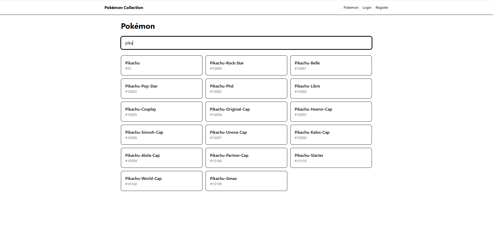

# Pokee

A small Pokémon collection app built with **Angular** and **Spring Boot**.



## Features

- 🔎 Pokémon search and details
- 🔐 JWT authentication
- 👤 Personal Pokémon collection
- ⭐ Rating and favorites
- 📝 Notes with editing
- 🗑️ Remove collection items
- ⚡ Caffeine caching
- 💾 SQLite persistence

## Tech Stack

**Frontend:** Angular · TypeScript · Signals · Reactive Forms · Tailwind CSS

**Backend:** Java 21 · Spring Boot · Spring Security · JWT · JPA · SQLite · Caffeine · Maven

**External API:** [PokéAPI](https://pokeapi.co/)

## Architecture

```text
┌─────────────────────────────┐
│          Angular            │
│                             │
│  Search │ Details │ Login   │
│  Collection │ Edit          │
└──────────────┬──────────────┘
               │
          REST + JWT
               │
               ▼
┌─────────────────────────────┐
│        Spring Boot          │
│                             │
│  Controllers               │
│       │                     │
│    Services                │
│       │                     │
│  ┌────┴──────────────┐     │
│  │                   │     │
│  ▼                   ▼     │
│ SQLite            Caffeine │
│                       │     │
│                       ▼     │
│                    PokéAPI  │
└─────────────────────────────┘
```

### Backend Responsibilities

- **Controllers** expose the REST API.
- **Services** contain business logic.
- **Spring Security + JWT** handle authentication and authorization.
- **SQLite + JPA** persist users, Pokémon and collection data.
- **Caffeine** caches the Pokémon catalog used for search.
- **PokéAPI** provides external Pokémon data when it is not available locally.

### Frontend Responsibilities

- Angular handles the UI and routing.
- Signals manage local application state.
- Reactive Forms handle login, registration and collection editing.
- An HTTP interceptor adds the JWT to authenticated requests.
- The frontend communicates only with the Spring Boot API.

### Collection Flow

```text
User
 │
 ▼
Angular
 │  POST /api/me/collection
 ▼
Spring Security
 │  identifies user from JWT
 ▼
CollectionService
 │
 ├── validates Pokémon
 ├── checks duplicate
 └── stores user-specific data
       │
       ▼
    SQLite
```

Each user has their own collection. The client does not provide a user ID; the backend determines the current user from the authenticated JWT.

## Requirements

- Java 21
- Node.js 20+
- PowerShell

## Run

From the project root:

```powershell
.\run.ps1
```

The script:

1. Checks that **Java, Node.js and npm** are installed.
2. Installs frontend dependencies if `node_modules` does not exist.
3. Starts the **Spring Boot backend**.
4. Starts the **Angular frontend**.
5. Opens the application in the default browser.

After startup:

- **Frontend:** http://localhost:4200
- **Backend:** http://localhost:8088

## Manual Start

**Backend**

```powershell
cd backend
.\mvnw.cmd spring-boot:run
```

**Frontend**

```powershell
cd frontend
npm install
npm start
```

## Project Structure

```text
Pokee/
├── backend/
│   └── src/main/java/com/example/pokemon/
│       ├── controller/
│       ├── service/
│       ├── repository/
│       ├── entity/
│       ├── dto/
│       ├── security/
│       └── external/
│
├── frontend/
│   └── src/app/
│       ├── core/
│       ├── models/
│       └── pages/
│           ├── login/
│           ├── register/
│           ├── pokemon-list/
│           ├── pokemon-detail/
│           └── collection/
│
├── docs/
│   └── screenshot.png
├── run.ps1
└── README.md
```